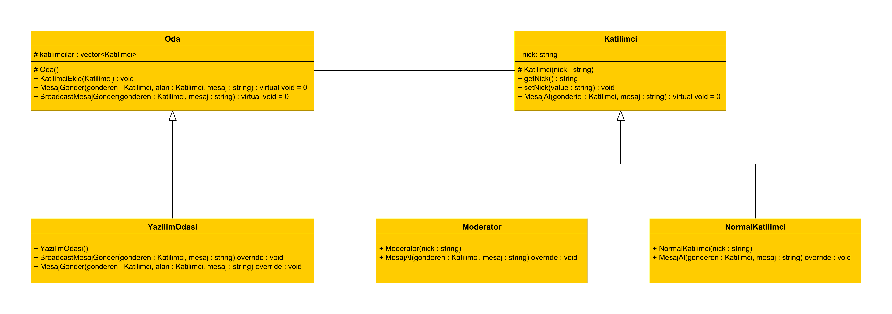

# Mediator Design Pattern

## UML Diagram

-> Daha büyük boyut için yeni sekmede açın.

## Output

<pre>
    Broadcast called.
    NormalKatilimci::MesajAl    Yunus Emre     ->  Hakan           : Herkese Merhaba
    NormalKatilimci::MesajAl    Yunus Emre     ->  Serdar          : Herkese Merhaba
    NormalKatilimci::MesajAl    Yunus Emre     ->  Aykut           : Herkese Merhaba
    NormalKatilimci::MesajAl    Yunus Emre     ->  Muhammed        : Herkese Merhaba
    Moderator::MesajAl          Yunus Emre     ->  Yunus Emre      : Herkese Merhaba
    Moderator::MesajAl          Yunus Emre     ->  Moderator       : Herkese Merhaba
    NormalKatilimci::MesajAl    Yunus Emre     ->  Normal          : Herkese Merhaba
    
    MesajGonder called.
    NormalKatilimci::MesajAl    Hakan          ->  Aykut           : K1'den K3'e
    NormalKatilimci::MesajAl    Aykut          ->  Hakan           : K3'den K1'e
    NormalKatilimci::MesajAl    Serdar         ->  Hakan           : K2'den K1'e
    NormalKatilimci::MesajAl    Hakan          ->  Serdar          : K1'den K2'e
    NormalKatilimci::MesajAl    Moderator      ->  Normal          : Moderatorden Normal
    Moderator::MesajAl          Normal         ->  Moderator       : Normal'den Moderator
</pre>
